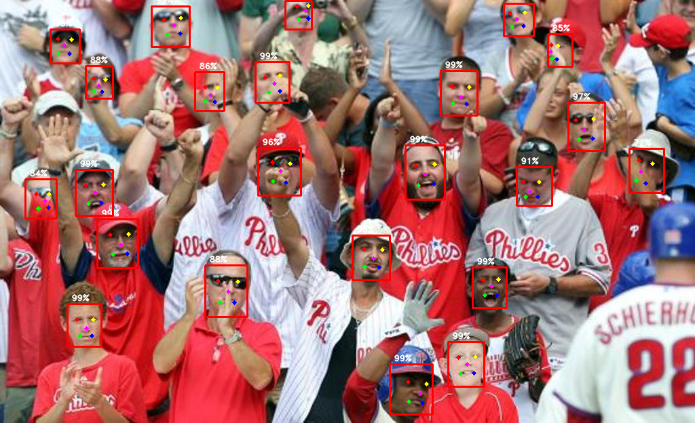
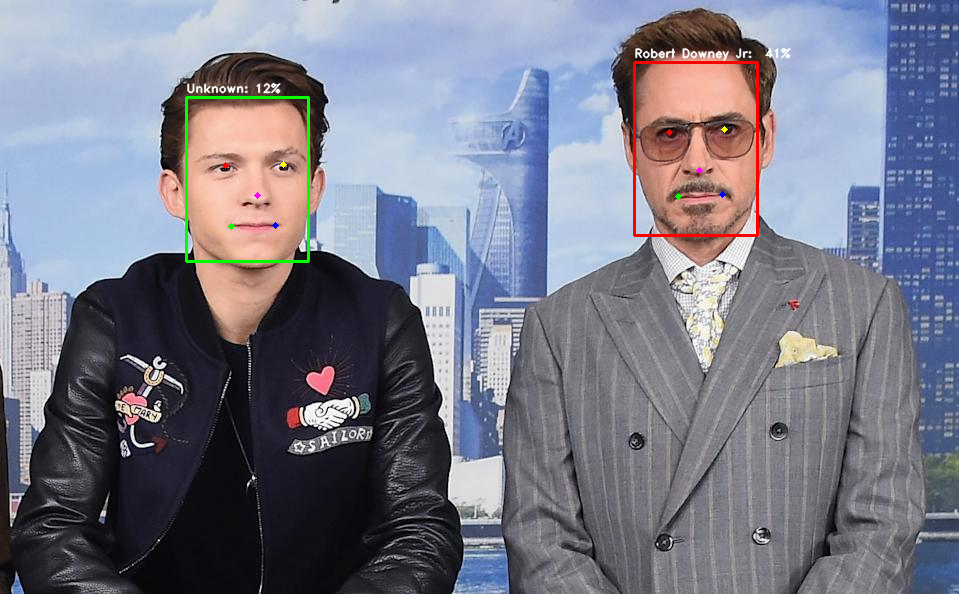

# EasyFace: Easy Face Analysis Tool with SOTA Models

## Table of Contents
* [Supported Models](#supported-models)
* [Benchmarks & Pretrained Models](#benchmarks--pretrained-models)
* [Requirements](#requirements)
* [Usage](#usage)
    * [Face & Landmark Detection](#face--landmark-detection)
    * [Face Recognition](#face-recognition)
    * [Facial Expression Recognition](#facial-expression-recognition)
    * [Age & Gender Estimation](#age--gender-estimation)
* [References](#references)


## Supported Models

Face & Landmark Detection

* [RetinaFace](https://arxiv.org/abs/1905.00641) (CVPR 2020)

Face Recognition

* [AdaFace](https://arxiv.org/abs/2204.00964) (CVPR 2022)


## Benchmarks & Pretrained Models

Check the models' comparison and download their pretrained weights from below.

* [Face & Landmark Detection](./easyface/detection/README.md)
* [Face Recognition](./easyface/recognition/README.md)


## Requirements

* torch >= 1.11.0
* torchvision >= 0.12.0

Other requirements can be installed with:

```bash
$ pip install -r requirements.txt
```

## Usage

### Face & Landmark Detection

> Need to download the pretrained weights for Face Detection Model from [here](./easyface/detection/README.md).

Run the following command to detect face and show bounding box and landmarks:

```bash
$ python detect_align.py \
    --source IMAGE_OR_FOLDER \
    --model RetinaFace \
    --checkpoint DET_MODEL_WEIGHTS_PATH \
```



### Face Recognition

> Need to download the pretrained weights for Face Detection and Face Recognition models from [Benchmarks & Pretrained Models](#benchmarks--pretrained-models) section.

Find the similarities between the given images:

```bash
$ python find_similarity.py \
    --source assets/test_faces \
    --model AdaFace \
    --checkpoint FR_MODEL_WEIGHTS_PATH \
    --det_model RetinaFace \
    --det_checkpoint DET_MODEL_WEIGHTS_PATH
```

> Notes: The size of the testing images can be different.

img1 | img2 | img3 
--- | --- | ---
 |  |  

```
# similarity scores
tensor([[1.0000, 0.0028, 0.0021],
        [0.0028, 1.0000, 0.6075],
        [0.0021, 0.6075, 1.0000]])
```


To register the new faces to a database:
* Create a folder containing the face images.
* One image per person.
* Rename the filename of the image to a person's name.
* Restrictions:
    * All images should be in the **same size**.
    * **Only one face** must exist in the image.
* Run the following to save all face embeddings into a pickle file:

```bash
$ python register.py \
    --source assets/test_faces \
    --output assets/faces.pkl \
    --model AdaFace \
    --checkpoint FR_MODEL_WEIGHTS_PATH \
    --det_model RetinaFace \
    --det_checkpoint DET_MODEL_WEIGHTS_PATH
```
Sample testing structure:

```
|__ data
    |__ test_faces
        |__ rdj.jpg
        |__ nc.jpg
        |__ ...
    |__ faces.pkl (output)
```

To recognize with a webcam or an image associated with the face database created in last step:

```bash
# with an image
$ python recognize.py \
    --source assets/img1.jpeg \
    --face_data assets/faces.pkl \
    --model AdaFace \
    --checkpoint FR_MODEL_WEIGHTS_PATH \
    --det_model RetinaFace \
    --det_checkpoint DET_MODEL_WEIGHTS_PATH \
    --recog_threshold RECOGNITION_THRESHOLD
```




### Facial Expression Recognition

Coming Soon...

### Age & Gender Estimation

Coming Soon...


## References

* [biubug6/Pytorch_Retinaface](https://github.com/biubug6/Pytorch_Retinaface)
* [mk-minchul/AdaFace](https://github.com/mk-minchul/AdaFace)